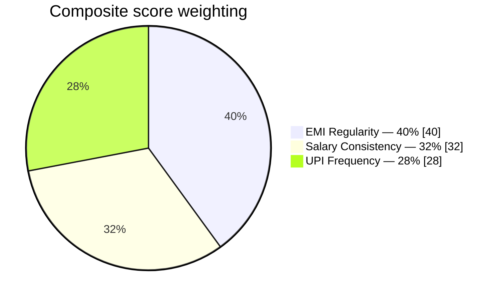
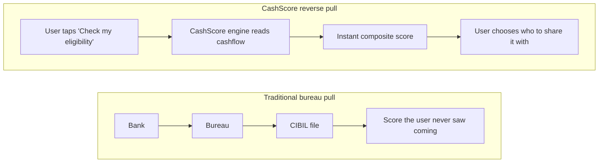
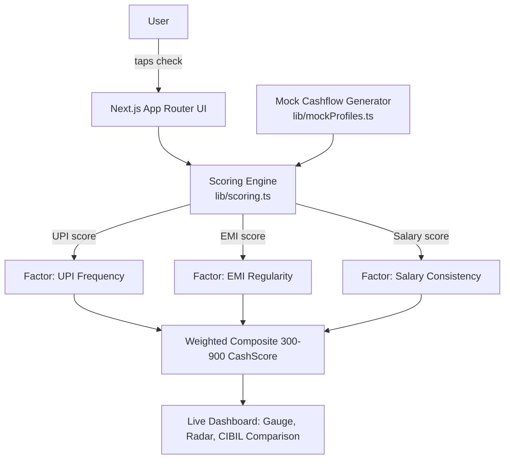

<div align="center">

# CashScore

### Behavioral credit scoring from real cashflow patterns — not just CIBIL.


[](https://nextjs.org)
[](https://www.typescriptlang.org)
[](https://tailwindcss.com)
[](https://threejs.org)
[](https://www.framer.com/motion/)
[](https://vercel.com)

**[Live demo →](https://mentos-cashscore.vercel.app)** &nbsp;·&nbsp; **[Pitch deck →](#)**

</div>

---

## The problem

Over **160 million Indians** are "credit invisible" — no loan history, no
credit card, no CIBIL file. Not because they're unreliable, but because
the bureau model only sees *borrowing* behavior, never *earning and
spending* behavior. A freelancer with six years of on-time UPI activity
and a steady client base looks identical to a first-time borrower on
paper: score unavailable.

## The idea

**CashScore** reads three signals that already exist in every bank
statement and composes them into a single behavioral score:



| Signal | What it measures | Why it matters |
|---|---|---|
| **UPI Frequency** | Transaction volume + rhythm over 90 days | Spend consistency signals financial engagement |
| **EMI Regularity** | On-time ratio across recurring obligations | Direct proxy for repayment discipline |
| **Salary Consistency** | Date & amount stability of recurring credits | The clearest signal of income reliability |

Each factor is normalized 0–100, weighted, and mapped onto a familiar
**300–900 scale** so lenders can adopt it without relearning a new range.

## The USP: reverse pull

Every bureau model starts with a lender pulling a file the user never
asked to be checked. CashScore flips it:



Self-initiated checks are privacy-forward, build trust, and produce
**higher-intent, consent-driven leads** for lenders — instead of a
silent pull the user finds out about after a rejection.

## Architecture



> **Prototype scope:** transaction data is generated by a seeded mock
> generator (`lib/mockProfiles.ts`) to demonstrate the scoring logic and
> UX end-to-end without a live bank/AA integration. The scoring
> algorithm (`lib/scoring.ts`) is real and swappable for a production
> data source (Account Aggregator framework, UPI PSP webhooks, bank
> statement parsing) without touching the UI layer.

## Tech stack

- **Next.js 16** (App Router, TypeScript) — routing, RSC, deployment
- **Tailwind CSS v4** — design system tokens (`ink` / `signal` green / `blue`)
- **Framer Motion** — staggered reveals, live step transitions, animated gauge
- **React Three Fiber + drei** — procedural 3D illustrations (distorted core, feature orbs)
- **Recharts** — factor radar chart, CIBIL comparison bars
- **Vercel** — deployment

## Running locally

```bash
npm install
npm run dev
```

- `/` — landing page: the problem, the three signals, the reverse-pull USP
- `/demo` — live scoring demo: pick a mock persona, watch the engine
  analyze cashflow in real time, see the composite score reveal against
  a simulated CIBIL comparison

## Project structure

```
src/
  app/
    page.tsx              # landing page
    demo/page.tsx          # live demo route
  components/
    landing/                # hero, features, USP, footer
    demo/                    # live demo orchestrator, gauge, charts
    three/                    # react-three-fiber scenes
  lib/
    scoring.ts                # composite scoring algorithm
    mockProfiles.ts            # seeded mock cashflow generator
```

## Team Mentos

| | |
|---|---|
| **Garv Bansal** | Team Lead |
| **Simran Rawat** | Team Member |

Submitted to **IDBI Innovate**.
